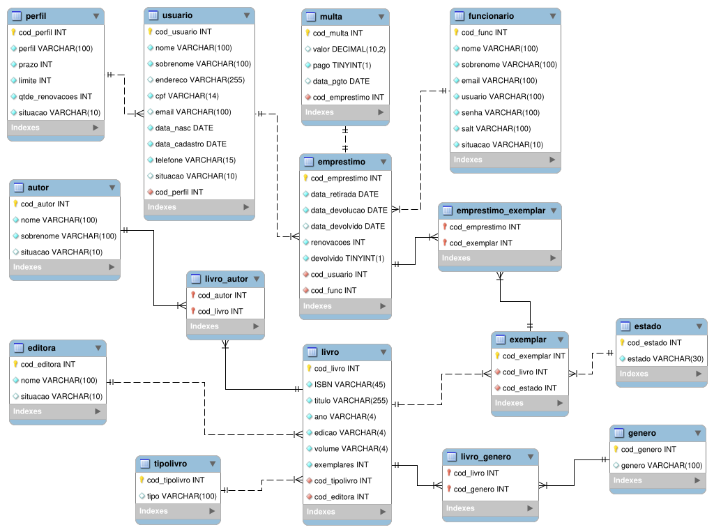

# BiblioSystem

## Sobre o projeto

BiblioSystem é uma aplicação desktop construída durante a disciplina de Programação de Aplicações, do curso de Eng. de Software da UNIVATES.

Esta aplicação consiste em gerenciar uma biblioteca através do cadastro de usuários (leitores e funcionários), livros, autores, editoras, etc. Além disso, a aplicação serve para o cadastro e controle de empréstimos, renovações, devoluções e multas de empréstimos atrasados.

## Modelo conceitual

## Tecnologias utilizadas
- Java 11
- PostgreSQL
- Docker
- JasperReports

## Softwares utilizados
- NetBeans
- DBeaver
- MySQL Workbench

## Autor

[Gustavo Martini](https://github.com/martinigustavo)

